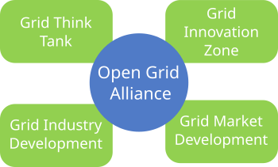
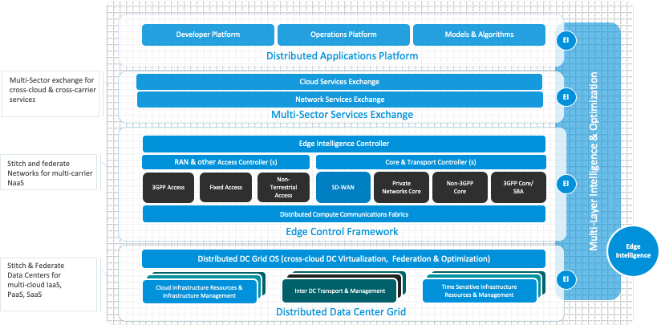

# Mission & Vision

The Open Grid Alliance (OGA) (http://opengridalliance.org) is a member-supported
collaboration organization that produces vendor-neutral strategies and solutions to
evolve the Internet to a global, shared platform - namely the Open Grid - and develop a global ecosystem.

It includes leaders from multiple industries and disciplines,
leveraging domain expertise that spans the entire stack,
encompassing the physical infrastructure as well as the software-driven networking, virtualization, automation, and application layers.

The OGA will embrace technologies that distribute the economics and flexibility of the cloud
through the network edge all the way to end users,
making it possible to build new classes of applications
that support billions of intelligent devices, the data that they generate,
and the new networking infrastructure that underpins their seamless operation.

The OGA defines key principles for the Open Grid,
identifies interoperable technologies that adhere to those principles,
and demonstrates proposed technologies in physical environments.
It documents how these technologies will impact cloud providers, developers,
vendors, communication service providers (CSPs), internet service providers (ISPs), and end users.
The OGA will promote collaboration and open architectures
that will enable the dynamic geo-distribution of applications, compute, and data.

# Introduction and Motivation

The Open Grid Alliance (OGA) started in Summer 2021 looking to catalyze the emergence of the edge infrastructure,
5G-and-beyond networks, and billions of IoT devices.

Since its inception 30+ members have joined the OGA to jointly realize the vision of an Open Grid.
The path to realize the vision will encompass the identification and solutions of fundamental and theoretic questions,
the development of proof of concepts, the establishment of an industrial ecosystem,
and the advancement of a market through four workstreams:
the Grid Think Tank, Grid Innovation Zone, Grid Industry Development and Grid Market Development
through interactions within the OGA as well as the global related ecosystem.

With the intent to provide services and personalized solutions to everyone, anywhere, at any time
to conquer the digital divide at the globe, the OGA assesses, monetizes, and evolves
various technologies ranging from radio, web, compute, AI/ML, etc. to achieve automation at global scale.

The Internet as we know it is just a communication vehicle—it is not ready for that planet scale automation just yet.
What is needed is a living, breathing foundation for the development of personalized and intelligent solutions for everyone.
With a circulatory system that stitches together all the digital resources owned and managed by different entities
across different parts of the world.
And with a nervous system that facilitates collaboration
between all of these “local brains” that run and operate these connectivity systems.
That living, breathing foundation…is the Open Grid.

To achieve this, the traditional ways of planning, designing, and operating digital systems will not cut it.
We have to devise a new approach for planning, designing and operating systems—and the successful approach will be recursive.
We must assess all these technological change vectors and their impact on our lives in order to build the Open Grid.
And that's what the OGA aims to accomplish.

Globally distributed, the Open Grid is the next step in the evolution of the Internet.
It weaves together a public and private fabric of compute, data, and intelligence
to enable contextually aware, immersive, distributed applications at the edge, on demand.
The Open Grid is an open architecture that to enable the dynamic and geo-distribution
of compute, services, and workloads, evolving the internet to serve the billions of devices and applications coming online.

# The Open Grid

The Open Grid is the inevitable evolution of the internet.

The legacy internet with its massively scaled data centers and its core-centric network topologies will no longer provide for our needs;
we must redesign our systems starting at the edge, augmenting today’s internet with new architectures
that enable the rapid deployment of workloads and services to the right locations, for the right reasons,
ensuring appropriate levels of latency, security, and resilience—and delivered at the right price, preferably at global scale.

The Open Grid will be a software-defined system
that stretches across the globe to support multi-cloud, hybrid cloud, near-prem and on-prem services
via fungible resources that are employed, when and where they are needed, on demand, and with service guarantees.

The Open Grid combines all the necessary components to support the next generation of applications.
It is the purposeful integration of hardware, software, networking, and infrastructure technologies
to support the next generation of emerging applications.

# Call for Actions

The Open Grid can only come about through deep collaboration and open architectures.
While many Open Grid technologies are being implemented today,
it will be a decades-long journey of innovation that will touch all levels of the stack,
from fiber optics to AI-driven workload automation.

The OGA therefore invites you all to join our effort to make its vision of evolving the internet
to close the digital divide for a better future for everyone in the globe!
